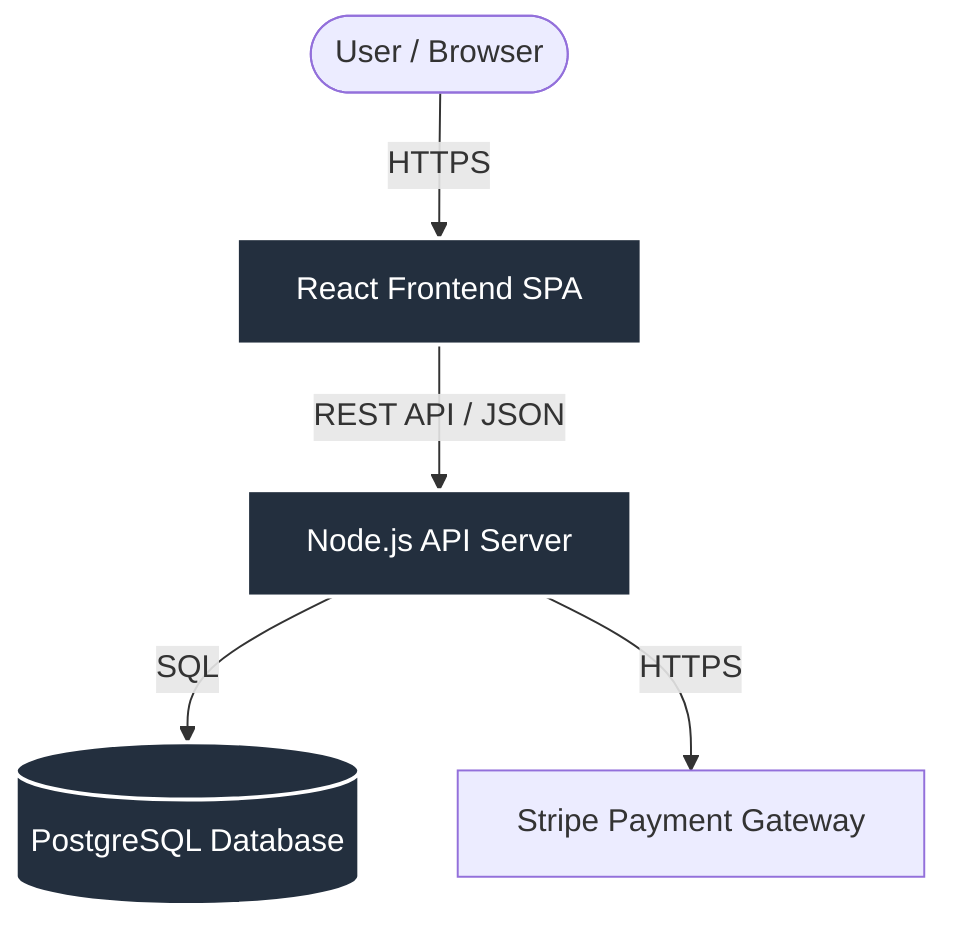

# Demo_zzulli
demonstration for Zzulli

Markdown

```mermaid
graph TD
    User([User / Browser]) -->|HTTPS| SPA[React Frontend SPA]
    SPA -->|REST API / JSON| API[Node.js API Server]
    API -->|SQL| DB[(PostgreSQL Database)]
    API -->|HTTPS| Stripe[Stripe Payment Gateway]

    classDef container fill:#232f3e,stroke:#fff,stroke-width:2px,color:#fff;
    class SPA,API,DB container;
```
